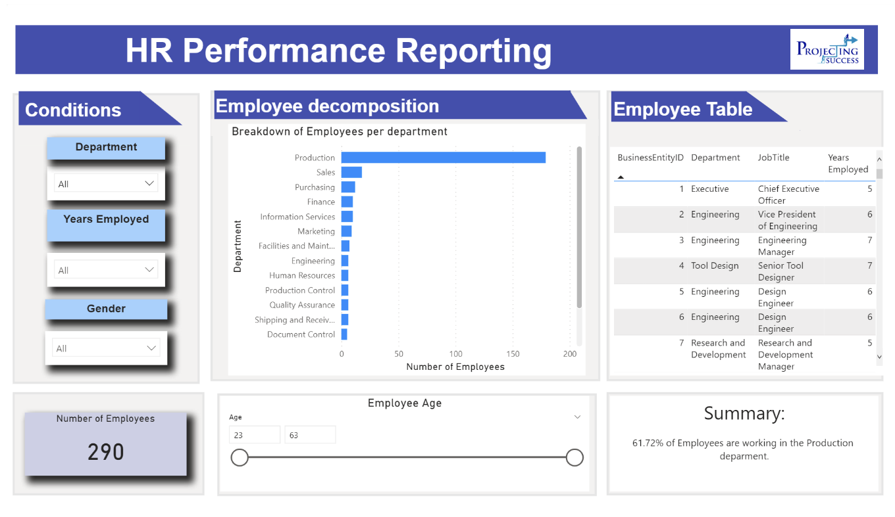
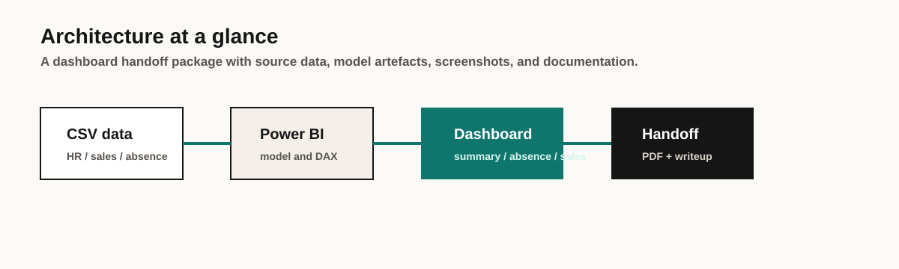

# HR Performance Reporting Dashboards

> Interactive Power BI dashboards analysing employee performance, sick leave patterns, and sales metrics for a global utility products company.

**For the full project portfolio** (methodology, documentation, video walkthrough): see [hr-performance-portfolio](https://github.com/MatthewPaver/hr-performance-portfolio).

---

## Status

`Dashboard portfolio`

This repository is the technical dashboard package: Power BI file, static exports, and dashboard previews. It is intended to show practical analytics delivery rather than application code. The prepared data lives inside the PBIX model; the raw CSV source data is not redistributed here.

## Reviewer Pack

| Area | Details |
|:---|:---|
| What it solves | Turns HR, absence, and sales data into a dashboard package for performance review and stakeholder handoff. |
| Screenshot | [Portfolio Store preview](https://matthewpaver.github.io/MatthewPaver/store/preview.html?app=hr) and [Dashboard Previews](#dashboard-previews) below |
| Run locally | Open `HR Performance Reporting Dashboards.pbix` in Power BI Desktop. |
| Tests | No automated tests; review is through the PBIX, PDF export, and documentation artefacts. |
| Demo data | Prepared data is embedded inside the PBIX model; raw CSVs are not redistributed. |
| Architecture | Source data -> Power BI model and DAX measures -> dashboard pages -> PDF/documentation handoff |
| Limitations | Dashboard delivery package rather than a code application; Power BI Desktop is required for interactive review. |

## Practical Test

Can HR, absence, and sales data be handed to a stakeholder as a review pack rather than a loose set of charts?

The useful check is the full path:

1. Inspect the source CSVs.
2. Open the PBIX or PDF export.
3. Review summary, absence, and sales views.
4. Read the methodology and commentary.
5. Use the package to discuss service pressure, absence patterns, and sales performance.

That is the point of the repo: show dashboard delivery and handoff, not just a screenshot.

## Portfolio Signal

- End-to-end dashboard packaging with `.pbix`, PDF export, and documentation
- Clear business framing around absence, performance, and sales signals
- Screenshots available directly in the README for fast review

## Reviewer Notes

- **Reproducible path:** open the `.pbix` in Power BI Desktop or review the static PDF export.
- **Delivery signal:** the repo includes dashboard assets, prepared slices, screenshots, and written methodology.
- **Business signal:** the analysis is framed around absence, service pressure, and sales performance rather than visuals alone.
- **Known limit:** this is a dashboard delivery package, so verification is through the PBIX/PDF/data artefacts rather than automated tests.

---

## Problem Statement

A global utility products company was experiencing high volumes of employee absences, poor service delivery, and increasing customer complaints. Management needed data-driven insights into HR performance to identify root causes and take action.

## Solution

Three interconnected Power BI dashboards that visualise employee decomposition, sick leave patterns, and sales performance — enabling management to identify problem areas and track improvements.

---

## Key Insights

| Metric | Finding |
|--------|---------|
| **Department concentration** | 61.72% of employees work in Production |
| **Average sick leave** | 9.09 hours/year per employee |
| **High absence threshold** | Employees exceeding 37.5 hours/year flagged for review |
| **Sales correlation** | Positive correlation between current and prior year sales by region |

---

## Repository Contents

| File | Description |
|------|-------------|
| `HR Performance Reporting Dashboards.pbix` | Interactive Power BI dashboard (requires Power BI Desktop) |
| `HR Performance Reporting Dashboards.pdf` | Static PDF export of all dashboard pages |
| `Project A HR Performance Reporting Documentation.pdf` | Full project documentation — methodology, analysis, recommendations |
| `Dashboard Images/` | PNG previews of the three dashboard pages |
| `docs/assets/` | Hero screenshot and architecture diagram |

---

## Dashboard Previews

### Summary Overview

Employee decomposition by department, age distribution, and overall performance indicators.

### Sick Leave Analysis

High and low sick leave patterns, absence rate trends, and departmental breakdowns.

### Sales Performance

Top performers, year-to-date vs previous year comparison, and regional analysis.

---

## Getting Started

1. **Open the dashboard** — Load `HR Performance Reporting Dashboards.pbix` in [Power BI Desktop](https://powerbi.microsoft.com/desktop/) to explore the interactive model and inspect the embedded data tables.
2. **Skim the static export** — `HR Performance Reporting Dashboards.pdf` shows every page if you do not have Power BI Desktop.
3. **Read the documentation** — `Project A HR Performance Reporting Documentation.pdf` covers methodology, findings, and recommendations.

---

## Methodology

1. **Data gathering** — Employee records, sick leave logs, sales performance metrics
2. **Data cleaning** — Prepared datasets in Excel 2021
3. **Analysis** — Statistical analysis and pattern identification
4. **Visualisation** — Built interactive Power BI dashboards
5. **Documentation** — Compiled findings and recommendations

---

## Related

- [hr-performance-portfolio](https://github.com/MatthewPaver/hr-performance-portfolio) — Summative portfolio PDF and video walkthrough
- [Project Index](https://github.com/MatthewPaver/MatthewPaver/blob/main/Projects.md) — Curated profile project index
