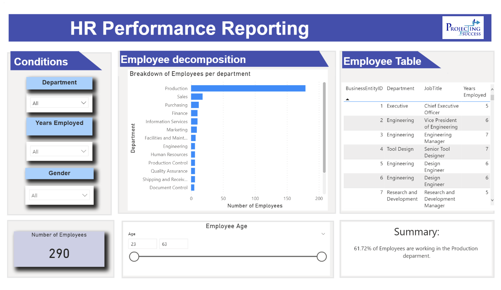
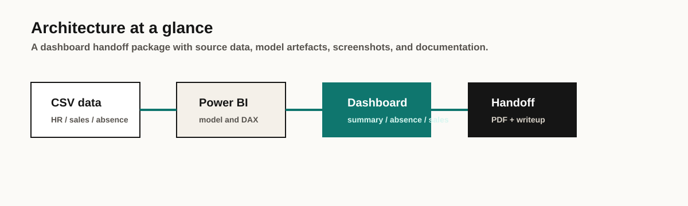

# HR Performance Reporting Dashboards

> A reproducible Power BI case study built on **Microsoft's fictional [AdventureWorks](https://learn.microsoft.com/en-us/sql/samples/adventureworks-install-configure) sample data**. It is not real HR data or evidence about real employees. The original dashboard was a learning exercise; this repository keeps it alongside a published correction of two field-interpretation errors.

> **Correction (read first):** the historical PBIX/PDF treated `SickLeaveHours` as absence taken and used `ModifiedDate` in age/tenure logic. In AdventureWorks, `SickLeaveHours` is an **available leave balance** and `ModifiedDate` is a **row-update timestamp**. The historical exports' absence and age/tenure figures are therefore unsupported. The same correction is explained on the [project page](https://matthewpaver.github.io/store/apps/hr/).

**Corrected data you can reproduce now:** [employee CSV](docs/rebuilt/current-employees.csv), [sales CSV](docs/rebuilt/sales.csv), [top five](docs/rebuilt/top-five-sales.csv), and [source hashes / reconciliation](docs/rebuilt/summary.json). Run `python3 scripts/rebuild_public_data.py --as-of 2014-06-30` with Python 3.10+ and internet access. No Python packages, SQL Server or Power BI are required for this data rebuild. It downloads five small official Microsoft sample tables pinned to a commit. The date is an explicit age/tenure calculation date, not an inferred sales reporting period.

The corrected [review report](output/pdf/corrected-hr-review.pdf) is generated from these CSVs. It does not silently replace the historical PBIX or its old exports. Their labels and measures remain superseded until rebuilt in Power BI Desktop.

---

## Status

`Dashboard portfolio`

This repository is the technical dashboard package: Power BI file, static exports, dashboard previews and a corrected reproducibility contract. It shows practical BI delivery rather than a validated HR insight product. The prepared data lives inside the PBIX model; the raw source tables are not redistributed here.

Do not use the historical labels for an HR decision. Rebuild with [`sql/adventureworks_review.sql`](sql/adventureworks_review.sql) and [`docs/SEMANTIC_CONTRACT.md`](docs/SEMANTIC_CONTRACT.md).

## Reviewer Pack

| Area | Details |
|:---|:---|
| What it solves | Demonstrates a Power BI model, visual review flow and handoff pack over fictional AdventureWorks employee/sales data. |
| Screenshot | [Dashboard Previews](#dashboard-previews) below |
| Run locally | Open `HR Performance Reporting Dashboards.pbix` in Power BI Desktop. |
| Tests | `python3 -m unittest discover -s tests -v` exercises the corrected transformations and the synthetic schema sample; `node scripts/validate-package.mjs` validates the handoff package. CI also rebuilds `docs/rebuilt/` from the pinned source and fails on drift. |
| Demo data | Prepared data is embedded inside the PBIX model; raw source CSVs are not redistributed. A separate 50-row synthetic schema sample is in `sample-data/`. |
| Architecture | Source data -> Power BI model and DAX measures -> dashboard pages -> PDF/documentation handoff |
| Reproduce | Follow [`docs/reproduce.md`](docs/reproduce.md) with Microsoft's public AdventureWorks sample database. |
| Limitations | Dashboard delivery package rather than a code application; Power BI Desktop is required for interactive review, and the PBIX has not yet been refreshed against the corrected contract. |

## Practical Test

Can a Power BI model and its interpretation be handed over as an inspectable review pack rather than a loose set of charts?

The useful check is the full path:

1. Read the semantic contract and reproduction guide. The prepared data is embedded in the PBIX; source CSVs are not included. `sample-data/hr-performance-synthetic.csv` shows a synthetic public schema only.
2. Open the PBIX or PDF export.
3. Review the summary, available leave-balance and sales views, keeping the historical labelling corrections beside them.
4. Read the methodology and commentary.
5. Use the package to discuss modelling choices, semantic definitions, visual design and handoff quality, not employee causes.

## Portfolio Signal

- End-to-end dashboard packaging with `.pbix`, PDF export, and documentation
- A visible correction trail showing how semantic mistakes are found and prevented in a rebuild
- Screenshots available directly in the README for fast review

## Reviewer Notes

- **Reproducible path:** run the rebuild script for corrected data, or open the `.pbix` in Power BI Desktop / review the static PDF export for the historical dashboard.
- **Delivery signal:** the repo includes the PBIX model, static exports, screenshots and written methodology.
- **Analytics signal:** field meanings, reporting dates and non-causal boundaries are explicit rather than inferred from visuals.
- **Known limit:** automated checks cover the corrected rebuild, package contents and the synthetic sample; they do not recalculate the historical Power BI measures.
- **Data boundary:** the `sample-data/` CSV is entirely synthetic and illustrates shape only; it cannot reproduce the dashboard figures.

---

## Historical brief

The original exercise asked for an HR and sales review pack for a fictional AdventureWorks organisation. The data does not evidence poor service, complaints or root causes; those were scenario framing, not findings.

## Solution

Three interconnected Power BI pages demonstrate employee composition, available leave balances and descriptive sales comparison. The current reproducibility layer corrects the historical interpretation without pretending the immutable export has already changed.

---

## Corrected figures (rebuilt, as of 2014-06-30)

From [`docs/rebuilt/summary.json`](docs/rebuilt/summary.json) and [`docs/rebuilt/current-employees.csv`](docs/rebuilt/current-employees.csv):

| Metric | Corrected value |
|--------|-----------------|
| **Current employees** | 290 (fictional) |
| **Department concentration** | 179 of 290 (61.72%) in Production |
| **Available sick-leave balance** | Mean 45.3 hours available. This is a balance, **not** hours absent, so no absence rate is reported |
| **Balance bands** | 0 below 15 h, 96 from 15 to 37.5 h, 194 above 37.5 h (reconciles to 290) |
| **37.5-hour threshold** | A demonstration band over an available balance; **not** an absence-risk threshold |
| **Sales** | 17 salespeople; `SalesYTD` total 36,277,591.90 vs `SalesLastYear` 23,685,963.62. Descriptive only: the snapshot periods are not established, so no growth claim |

The historical exports' "average sick leave" and "high absence" figures are superseded by this table.

---

## Repository Contents

| File | Description |
|------|-------------|
| `HR Performance Reporting Dashboards.pbix` | Historical interactive Power BI dashboard (requires Power BI Desktop) |
| `HR Performance Reporting Dashboards.pdf` | Historical static PDF export of all dashboard pages |
| `Project A HR Performance Reporting Documentation.pdf` | Historical project documentation (pre-correction) |
| `Dashboard Images/` | PNG previews of the three historical dashboard pages |
| `docs/` | Semantic contract, reconciliation checklist, reproduction guide, rebuilt CSVs |
| `scripts/`, `sql/`, `tests/` | Corrected rebuild, SQL equivalent, package validator and tests |
| `output/pdf/corrected-hr-review.pdf` | Review report generated from the corrected CSVs |
| `sample-data/` | 50 synthetic rows plus a public field dictionary |

---

## Dashboard Previews

### Summary Overview

Historical employee summary. The age and tenure displays must not be relied on: their former `ModifiedDate` interpretation is superseded by the semantic contract.

### Available Sick-leave Balance Analysis

Historical balance bands and departmental breakdowns. The image's absence-oriented interpretation is superseded by the semantic contract.

### Sales Performance

Top performers, year-to-date vs previous year comparison, and regional analysis (descriptive only).

---

## Getting Started

1. **Rebuild the corrected data**: `python3 scripts/rebuild_public_data.py --as-of 2014-06-30`.
2. **Open the dashboard**: load `HR Performance Reporting Dashboards.pbix` in [Power BI Desktop](https://learn.microsoft.com/en-us/power-bi/fundamentals/desktop-get-the-desktop) to explore the historical model.
3. **Skim the static export**: `HR Performance Reporting Dashboards.pdf` shows every page if you do not have Power BI Desktop.
4. **Read the documentation**: `Project A HR Performance Reporting Documentation.pdf` covers the original methodology; read it with the correction above.

---

## Methodology

1. **Data gathering**: fictional AdventureWorks employee records, available leave balances and sales fields
2. **Data cleaning**: prepared datasets in Excel 2021 (historical); `scripts/rebuild_public_data.py` (corrected)
3. **Analysis**: descriptive summaries and balance bands
4. **Visualisation**: interactive Power BI dashboards
5. **Documentation**: original handoff documentation, plus the semantic contract and reconciliation checklist

---

## Reproducibility

The report uses Microsoft's fictional AdventureWorks sample data rather than private HR records. The PBIX keeps the prepared model for inspection; [`docs/reproduce.md`](docs/reproduce.md) maps the source tables, transformations, measures, and known version caveat so another analyst can rebuild the exercise from the official sample database.

An earlier stakeholder-only package has been retired. This repository is the maintained, canonical case study. An older private apprenticeship portfolio is a separate body of work, not an earlier version of this dashboard.

See the [curated project index](https://github.com/MatthewPaver/MatthewPaver/blob/main/Projects.md)
for the wider portfolio.
